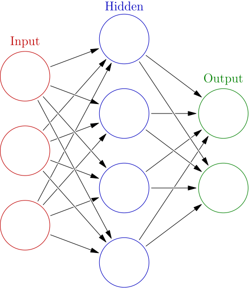

## Neuronale Netze

Bei der sog. Transformer-Architektur von generativer KI wie z.B. GPT handelt es sich um künstliche Neuronale Netze (KNN), die der Funktionsweise von natürlichen neuronales Netzen wie z.B. in einem Gehirn nachempfunden sind.

Die Neuronen in einem neuronalen Netz werden dabei in Schichten (Layern) hintereinander angeordnet. Man spricht von der Eingabeschicht (input layer, grün), der Ausgabeschicht (output layer, gelb) und den versteckten Schichten (hidden layer, blau).

Ein einzelnes künstliches Neuron ist dabei mit allen Neuronen der vorgelagerten Schicht verbunden. Die Verbindingen darf man sich nicht wie Schalter (ein/aus) vorstellen. Vielmehr werden die Signale aller Eingaben gewichtet und mit einer Übertragungsfunktion als Netzeingabe verwendet. Eine Aktivierungsfunktion führt unter Berücksichtigung eines Schwellwerts zur Aktivierung des Neurons (das Neuron feuert). Die Gewichtungen entsprechen den Parametern des Netzes (ein Llama 2 7B Modell hat z.B. 7 Milliarden solcher Parameter).

Beim Training eines neuronalen Netzwerks startet man mit zufälligen Parametern. Im Trainingsprozess werden die Parameter durch einen Prozess des maschinellen Lernens  über die Berechnung einer Fehlerfunktion so eingestellt, dass das neuronale Netz möglichst richtige Antworten liefert.

In [diesem Erklärvideo](https://www.youtube.com/watch?v=aircAruvnKk) wird dargestellt, wie ein neuronales Netz Zahlen erkennen kann (z.B. die Postleitzahl auf einem Brief). Als Eingabeschicht wird ein 28x28 Pixel großes Bild verwendet (784 Eingaben). Das verwendete Netz hat zwei versteckte Schichten. Die Ausgabeschicht hat zehn Ausgaben (Indikatoren für die Zahlen 0-9).
